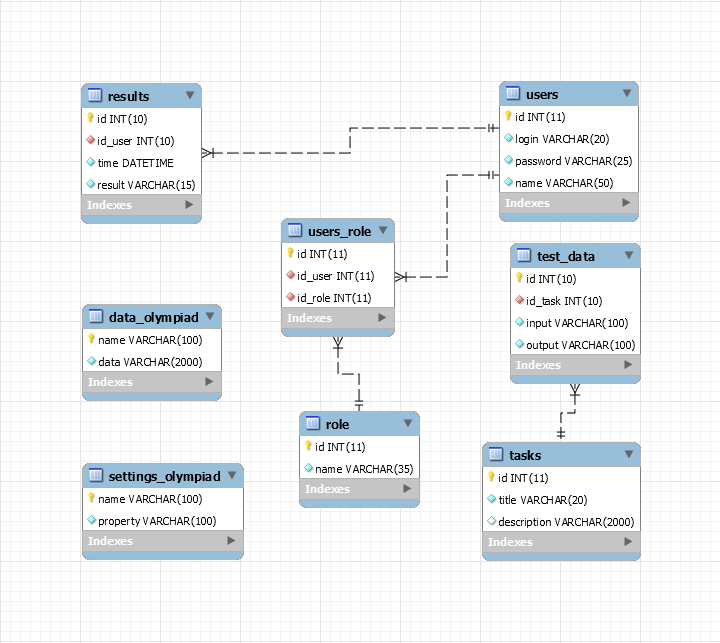

## Structure of Database

Database of OLSystem contains eight tables:
- Table **tasks** contains information about the tasks for olympiad.
- Table **test_data** contains test data for tasks of Olympiad. Test data
 for tasks is needed to exclude the participant's ability to adjust 
 the correct answer for the task.
- Table **data_olympiad** stores basic information about olympiad. Here are 
necessary fields with names(creatorOlympiad, numberCreator, nameOlympiad,
descriptionOlympiad, linkToWebSite, nameWebSite and linkToIconOlympiad) that 
must be present in the table.
- Table **settings_olympiad** stores settings of Olympiad(time and 
programming language for the Olympiad). Here are necessary fields with 
names(timeOlympiad and programmingLanguage) that must be present in 
the table.
- Table **users** contains information about about participants of the Olympiad
and administrators.
- Table **results** contains the results of the olympiad for each participant.
- Table **role** contains data about role of user(PARTICIPANT or ADMIN).
- Table **users_role** linking table of users with their roles.

## How to import database for OLSystem
For import database on your computer, you will need to have MySQL server and 
download file *database_import.sql* in current directory. Assuming you're on
a Linux or Windows console:

    mysql -u <username> -p<password> <databasename> < <filename.sql> // template
    mysql -u root -padmin OLSystem < database_import.sql             // example
    
After importing you will get structure of database and its initial necessary data.