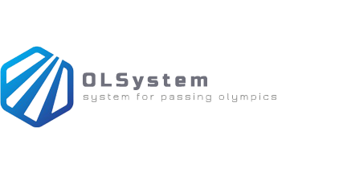

## About OLSystem

*OLSystem* - it's a cross-platform system for conducting Olympiads by programming in different
programming languages. This software product frees the teacher from tedious and error-phone
checking of the olympiad programs and summarizing the results of the participants manually.
At the moment, the system supports the following languages: C, C++ and Python. It's also 
planned to add support for other languages. The *OLSystem* is a browser  application, it works 
perfectly on different devices(mobile, tablet, laptop and PC). It's worth noting, that system
supports administrator room for changing of conducting Olympiad, in which administrator can:

- change basic information about conducting Olympiad(title, description, creators and much more); 
- add, remove and change tasks for participants;
- change programming language of Olympiad;
- change time for the that is given for the passage olympiad;
- remove outdated participants;
- observe for the results of the all participants.

This system is a modular application. It consists of the following modules:

- [GUI - Vue.js](./GUI)
- [Database - MySQL](./Database)
- [Program for checking tasks - C++](./ProgChecker)
- [The whole system that unites all - Java](./OLSystem)

Each module is a separate unit. Thanks to this, independently of other modules, it is possible to change 
a certain module or completely replace it with another one.

## What you need to build OLSystem
For build a *OLSystem* on your computer, you will need to have the following
applications:

- Git
- JDK/JRE
- TomCat
- Maven
- MySQL
- CMake

For Windows, you should download and install [Git](https://git-scm.com/download), 
[JDK/JRE](http://www.oracle.com/technetwork/java/index-jsp-138363.html), 
[TomCat](https://tomcat.apache.org/download-80), 
[Maven](http://maven.apache.org/download.cgi),
[MySQL](https://dev.mysql.com/downloads/installer/).

For OS X users should install Homebrew. Once Homebrew is installed, run:
    
    brew install git
    brew install java
    brew install tomcat
    brew install maven
    brew install mysql
    brew install cmake

For Linux/BSD users should use their appropriate package managers to install:

    apt-get install git
    apt-get install default-jre
    apt-get install default-jdk
    apt-get install tomcat8
    apt-get install maven
    apt-get install mysql-server
    apt-get install cmake

## How to build OLSystem
Clone a copy of the main OLSystem git repository by running:

    git clone https://github.com/VladimirBalun/OLSystem.git

Enter the OLSystem directory and run the build script on Windows:

    build.bat

Enter the OLSystem directory and run the build script on OS X or Linux/BSD:

    ./build.sh
    
If you don't have installing compilers on interpreters for supporting programming languages by *OLSystem*
on your computer, you can run script and automatically install standard compilers and 
interpreters for C, C++ and Python. On Linux/BSD or OS X run:

    ./languages.sh

Script for Windows will be added later...